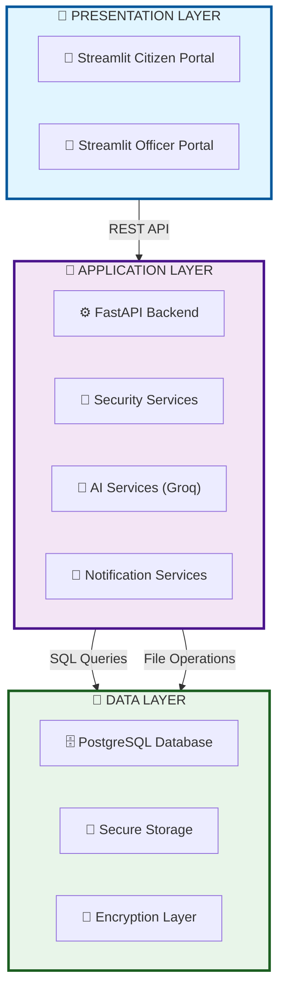
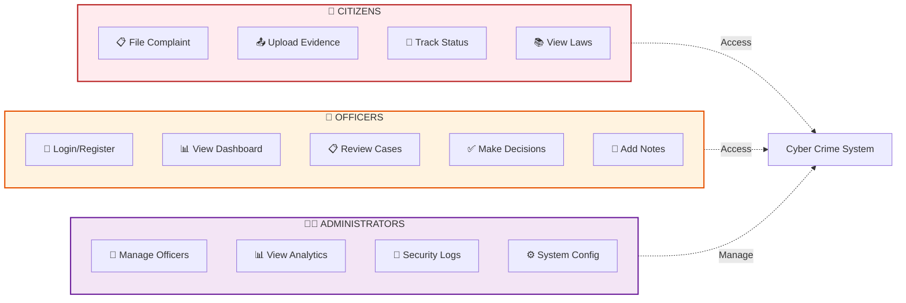
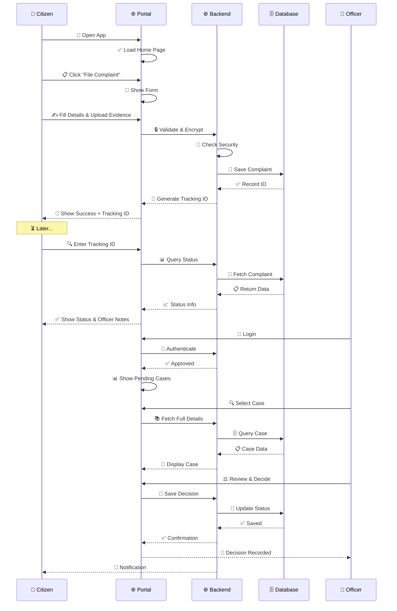
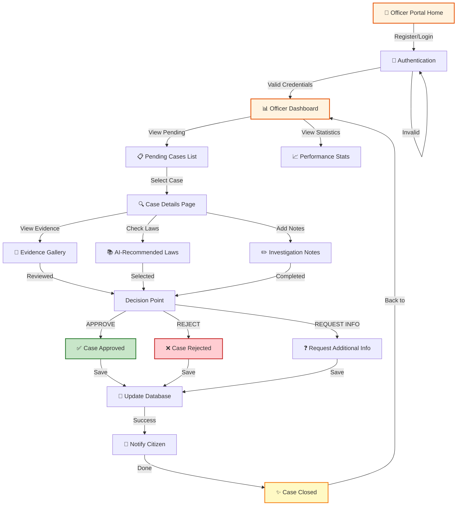
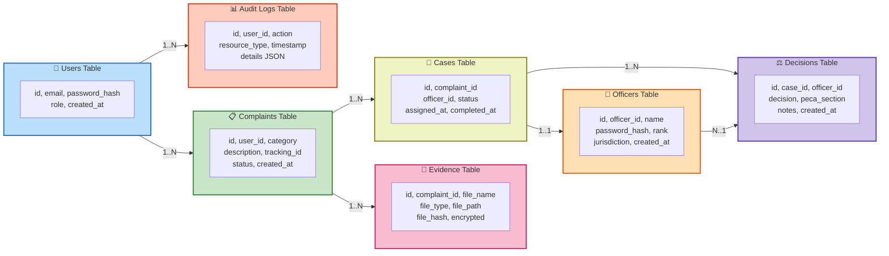
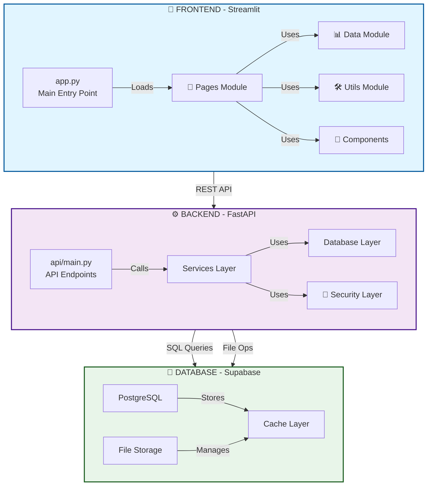
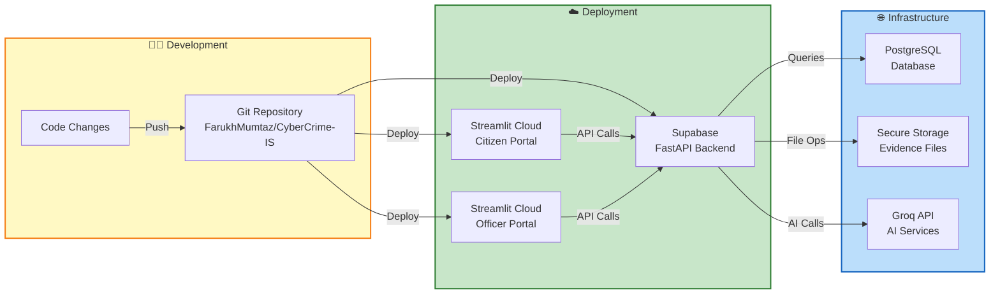
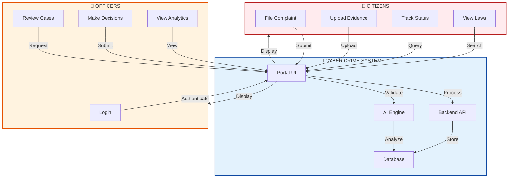
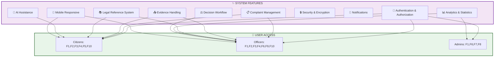

# 📊 System Diagrams & Architecture Documentation

**Cyber Crime Reporting System - Pakistan**  
**Professional Visual Guide to System Architecture & Workflows**

---

## 📋 Table of Contents

1. [System Architecture](#system-architecture)
2. [Citizen Complaint Flow](#citizen-flow)
3. [Officer Case Management](#officer-flow)
4. [Database Structure](#database)
5. [Component Architecture](#components)
6. [Security Layers](#security)
7. [Deployment Pipeline](#deployment)
8. [User Interactions](#interactions)

---

## 🏗️ System Architecture

### 3-Layer Architecture Overview

---

## 👥 User Roles & Permissions

---

## 📋 Citizen Complaint Workflow

### End-to-End Citizen Journey

---

## 👮 Officer Case Management Workflow

### Officer Complete Journey

---

## 💾 Database Schema & Structure

### Complete Database Architecture

---

## 🔧 System Components & Modules

### Frontend & Backend Architecture

---

## 🔐 Security Architecture - 5 Layers

### Complete Security Implementation

```mermaid
graph TB
    subgraph Layer1["🌐 LAYER 1: Transport Security"]
        L1_A["HTTPS/TLS 1.3"]
        L1_B["Certificate Validation"]
        L1_C["Secure Headers"]
    end

    subgraph Layer2["🔐 LAYER 2: Application Security"]
        L2_A["JWT Authentication"]
        L2_B["Session Management"]
        L2_C["CORS Policy"]
        L2_D["Rate Limiting"]
        L2_E["Input Validation"]
    end

    subgraph Layer3["🔒 LAYER 3: Data Security"]
        L3_A["AES-256 Encryption"]
        L3_B["bcrypt Hashing"]
        L3_C["Field Encryption"]
        L3_D["Token Security"]
    end

    subgraph Layer4["🗄️ LAYER 4: Database Security"]
        L4_A["Row Level Security"]
        L4_B["SQL Injection Prevention"]
        L4_C["Access Control"]
        L4_D["Audit Logging"]
        L4_E["Backups"]
    end

    subgraph Layer5["🛡️ LAYER 5: Infrastructure Security"]
        L5_A["DDoS Protection"]
        L5_B["Firewall Rules"]
        L5_C["IP Whitelisting"]
        L5_D["VPC Isolation"]
    end

    Request["🔗 User Request"]
    
    Request -->|Passes through| Layer1
    Layer1 -->|Validates| Layer2
    Layer2 -->|Secures| Layer3
    Layer3 -->|Protects| Layer4
    Layer4 -->|Infrastructure| Layer5
    Layer5 -->|Allows| Response["✅ Secure Response"]
    
    style Layer1 fill:#e0f2f1,stroke:#004d40,stroke-width:2px
    style Layer2 fill:#f1f8e9,stroke:#33691e,stroke-width:2px
    style Layer3 fill:#fce4ec,stroke:#880e4f,stroke-width:2px
    style Layer4 fill:#e3f2fd,stroke:#0d47a1,stroke-width:2px
    style Layer5 fill:#fff3e0,stroke:#e65100,stroke-width:2px
```

---

## 🚀 Deployment Pipeline

### Cloud Infrastructure Flow

---

## 🔄 User Interaction Diagram

### Complete System Interactions

---

## 📊 Feature & Capability Matrix

### All System Features

---

## 📝 Notes & Documentation

- **All Diagrams**: Mermaid syntax (GitHub compatible)
- **Rendering**: Works on GitHub without external tools
- **Mobile Friendly**: Responsive and accessible
- **Professional**: Enterprise-grade visualization
- **Current**: As of May 18, 2026
- **Status**: ✅ Production Ready

---

## 🔗 Related Documentation

- [README.md](../README.md) - Project Overview
- [API Documentation](./api/api_documentation.md) - API Reference
- [Security Guide](./SECURITY.md) - Security Details
- [Deployment Guide](./DEPLOYMENT.md) - Deploy Instructions
- [User Guide](./guides/user_guide.md) - How to Use

---

**Last Updated**: May 18, 2026 | **Version**: 2.0 | **Status**: ✅ Production Ready
